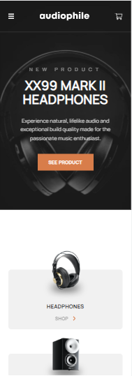
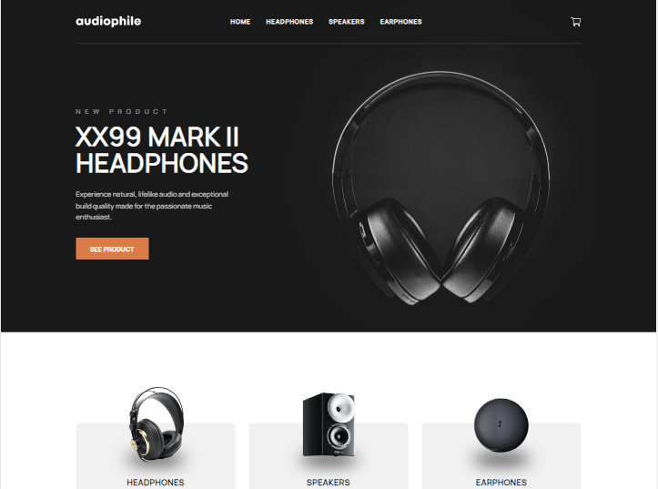

# Frontend Mentor - Audiophile e-commerce website solution

This is a solution to the [Audiophile e-commerce website challenge on Frontend Mentor](https://www.frontendmentor.io/challenges/audiophile-ecommerce-website-C8cuSd_wx), created whit react and sass. Frontend Mentor challenges help you improve your coding skills by building realistic projects. 

### Install all dependencies

```
npm install
```

## Start the project

```
npm start
```

## Table of contents

- [Overview](#overview)
  - [The challenge](#the-challenge)
  - [Screenshot](#screenshot)
  - [Links](#links)
- [My process](#my-process)
  - [Built with](#built-with)
  - [What I learned](#what-i-learned)
  - [Continued development](#continued-development)
  - [Useful resources](#useful-resources)
- [Author](#author)
- [Acknowledgments](#acknowledgments)

## Overview

### The challenge

Users should be able to:

- View the optimal layout for the app depending on their device's screen size
- See hover states for all interactive elements on the page
- Add/Remove products from the cart
- Edit product quantities in the cart
- Fill in all fields in the checkout
- Receive form validations if fields are missed or incorrect during checkout
- See correct checkout totals depending on the products in the cart
  - Shipping always adds $50 to the order
  - VAT is calculated as 20% of the product total, excluding shipping
- See an order confirmation modal after checking out with an order summary
- **Bonus**: Keep track of what's in the cart, even after refreshing the browser (`localStorage` could be used for this if you're not building out a full-stack app)

### Screenshot





### Links

- Solution URL: [Code](https://github.com/JimAxl1/Audiophile_e-commerce)
- Live Site URL: [Demo](https://audiophile-e-commerce-f22ea.web.app)

## My process

### Built with

- Semantic HTML5 markup
- CSS
- [Sass](https://sass-lang.com/)
- Flexbox
- CSS Grid
- Mobile-first workflow
- [React](https://reactjs.org/) - JS library
- [React Router](https://reactrouter.com/en/main) - React framework
- [React Hook Form](https://www.react-hook-form.com/)
- [Firebase](https://firebase.google.com/)

### What I learned

I learned react router to make the project more efficient, and now I can say that I know how to make an e-commerce web app.

### Continued development

I would like to improve in code, be a better developer and learn more tools about frontend.

### Useful resources
This websites helped me to solve some problems during the development, I wrote the problems I had with the development of code in the browser and these were the pages I used the most

- [Stack Overflow](https://stackoverflow.com/)
- [developer mozilla](https://developer.mozilla.org/)

## Author

- Frontend Mentor - [@JimAxl1](https://www.frontendmentor.io/profile/JimAxl1)
- Github - [@JimAxl1](https://github.com/JimAxl1)

## Acknowledgments

Coffe, tea and the people of StackOverflow